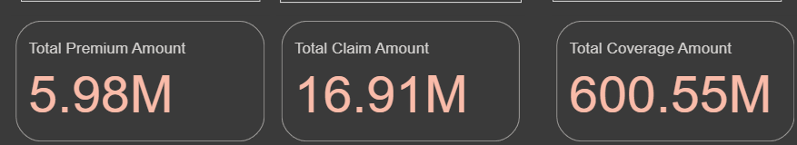
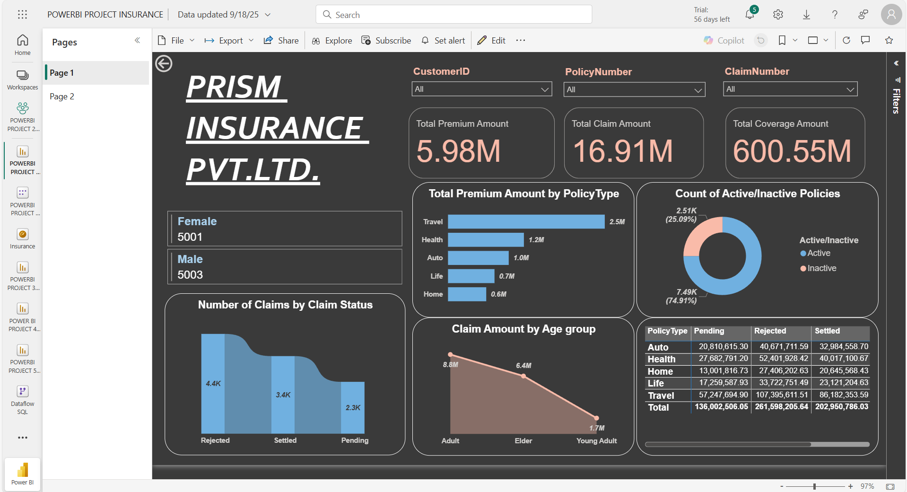
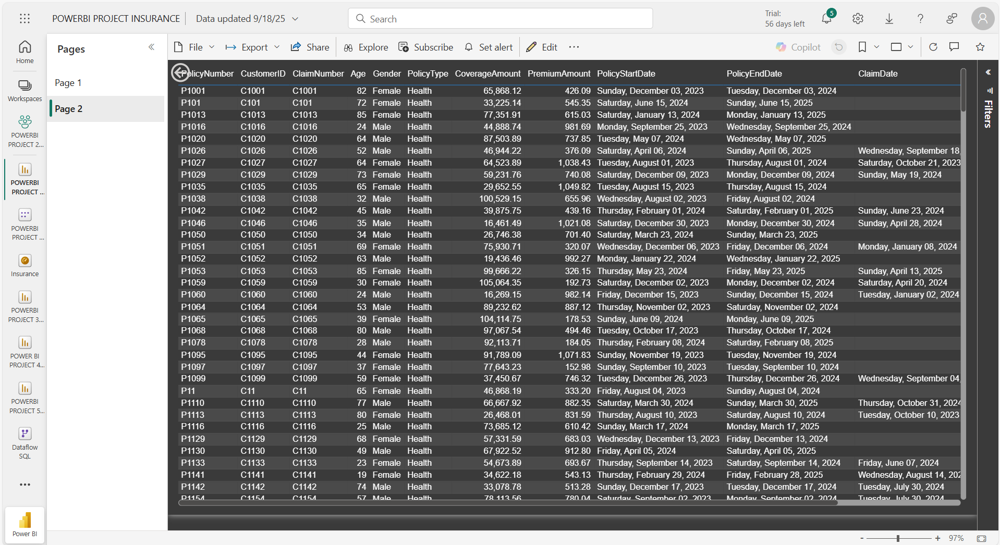

# Insurance Analytics Dashboard (Datasource: SQL Server → Power BI)

### Dashboard Link : https://app.powerbi.com/reportEmbed?reportId=f97dd66f-5503-4363-befb-13aaea9d1647&autoAuth=true&ctid=4190cc35-fd93-4aa6-9817-c1121132f7e2

## Problem Statement

This dashboard provides an end-to-end analysis of insurance policies and claims, enabling stakeholders to monitor key KPIs such as premium amounts, coverage, claim volumes, and customer demographics. Through the visuals, users can explore customer profiles (age, gender), policy types, claim statuses, and financial metrics like total premium, coverage, and claim amounts.

The solution integrates SQL Server for data storage, Power Query for cleaning and transformation, and Power BI for visualization. Features such as slicers, drill-through, and conditional formatting enhance interactivity, while advanced visuals like ribbon charts, stacked bars, line charts, and matrices provide deep insights into policy activity, claim performance, and customer segmentation.

Overall, this dashboard empowers insurers to identify high-risk segments, monitor policy activity, and evaluate claim trends, ensuring data-driven decision-making to improve customer satisfaction and operational efficiency.

### Steps followed 

- Step 1 SQL Server Database Setup:
The project began by creating a dedicated SQL Server database named insurance DB. Data was imported from CSV files into SQL Server using the Import Flat File wizard. During import, data types were validated (e.g., ensuring policy number was stored as varchar rather than money). The imported tables were explored to confirm data integrity before further use

- Step 2 Data Connection in Power BI:
Power BI Desktop was connected to SQL Server in Import mode. The dataset (~10,000 rows) was loaded from the insurance DB and opened in Power Query Editor for preview and transformation. Columns such as policy number, customer ID, gender, policy and claim details, amounts, and claim status were reviewed to ensure completeness.

- Step 3 Data Profiling and Preparation:
Data profiling was performed by enabling column distribution, quality, and profiling based on the entire dataset (not just the top 1,000 rows). Data types were corrected (text for identifiers, numbers for amounts, dates for policy and claim dates). Null values were observed in claim dates (~44%), which were accepted as valid. Claim status categories were confirmed as Rejected, Settled, and Pending.

- Step 4 Report Design and Formatting:
A dark theme was applied for modern styling. Slicers were created for Policy Number, Claim Number, and Customer ID and arranged in dropdown format for accessibility. A text box was added with the company name Prism Insurance Private Limited. Fonts were standardized across slicers and visuals for consistency.

- Step 5 KPI and Card Visuals:
Card visuals were added to display Total Premium Amount, Total Coverage Amount, and Total Claim Amount. A Multi-Row Card was included to show gender distribution of customers. These visuals provided immediate, high-level KPIs for stakeholders.

- Step 6 Aggregate and Comparative Visuals
A Ribbon Chart was created to visualize claims by claim status. A Stacked Bar Chart displayed Premium Amount by Policy Type, while a Line Chart showed claim amounts across Age Groups. The Age Group column was created in Power Query to classify customers as Young Adult, Adult, or Elder.

- Step 7 Status and Segmentation:
A calculated column for Active/Inactive policy status was created based on expiration date. A Donut Chart displayed active vs inactive policies, while a Matrix visual analyzed Coverage Amount by Policy Type (rows) and Claim Status (columns), enabling cross-sectional analysis.

- Step 8  Drill-through Functionality
A drill-through page was added with a table visual displaying granular details of all fields. Users could right-click on a policy type in the bar chart and drill through to view filtered details. A back button was included for seamless navigation back to the summary view.

- Step 9 Publishing 
The report was published to Power BI Service under a dedicated workspace.

# Snapshot of Dashboard (Power BI Service)

 

## Insights  

This Power BI dashboard provides a comprehensive analysis of insurance data including premiums, claims, coverage, policies, and demographics. It enables stakeholders to track performance by policy type, age group, gender, and claim status.

The total premium collected amounts to **5.98M**, with a total claim amount of **16.91M** and a coverage amount of **600.55M**. Among policy types, **Travel insurance contributes the highest premium (2.5M)**, followed by health and auto, while life and home policies contribute comparatively less. Nearly **75% of policies are active**, leaving about a quarter inactive, which highlights scope for re-engagement.

In terms of claims, **rejected claims (4.4K) are higher than settled claims (3.4K)**, with 2.3K claims still pending. Adults account for the largest claim amount (8.8M), followed by elders (6.4M), while young adults contribute significantly less (1.7M). Travel insurance records the highest settled claim amount **(86.18M)** but also faces the highest rejections **(107.39M)**, showing both strong demand and high risk. Health and auto policies show balanced claim settlements, while life and home policies have more moderate claim amounts.

The customer base is evenly distributed across gender, with **5,001 female and 5,003 male customers**, showing no major demographic bias in policyholding. A detailed data exploration page further enables drill-down into specific policies, claims, and customer records for deeper analysis.

Overall, the dashboard highlights that travel insurance is the most profitable but riskiest product, adults drive the majority of claims, and high rejection rates suggest the need for clearer policy communication and better claims management. These insights empower insurance managers and analysts to monitor performance, manage risks, and optimize strategies for profitability and customer trust.
